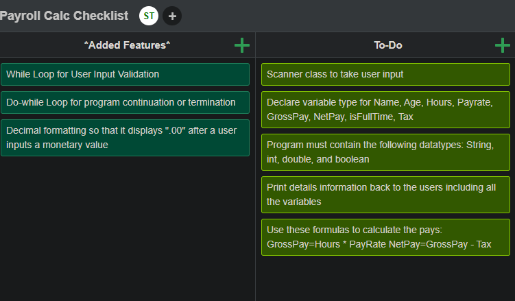

# Intro

This was the first project that I worked on in Java and also served as my first project due for my Intro to Programming course. The project was to create an application that would take user input and display gross pay and net pay based on user values. Since this was my first project, the main goal was just to familiarize myself and get comfortable with the Java environment. I will update this project soon so that it more reflects my Custom PC Builder project in structure and appearance. It is always a good thing to look back at where you started and assess the progress to see how far you have come.

## Criteria Checklist

I was able to complete all the requirements and added some other features to make the program more versatile. I had the mentality that if this program were to be used by actual users, I would want to make it validate user input by preventing incorrect values from being entered. 

## Live Demo
Click on the YouTube video to see a live demo of the application!

<iframe width="410" height="231" src="https://www.youtube.com/embed/KKPpZpa7beE" frameborder="0" allow="accelerometer; autoplay; clipboard-write; encrypted-media; gyroscope; picture-in-picture" allowfullscreen></iframe>

## Future Improvements

* Apply OOP 
* Implement multiple classes
* Update appearance with menus and formatted tables similar to the Custom PC Builder project
* Add more questions such as employee ID, overtime hours, and allow for users to input tax

